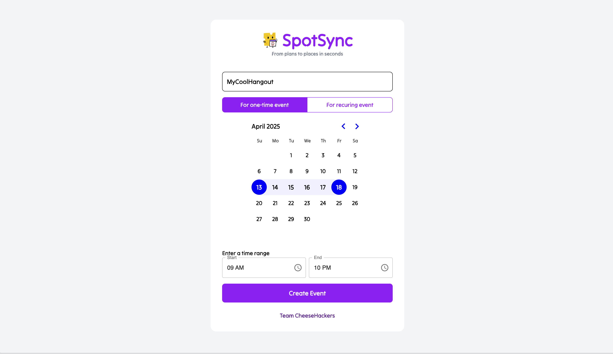
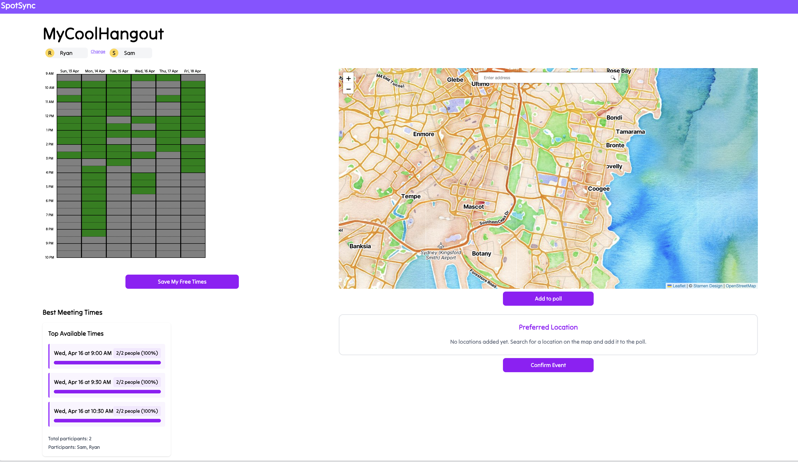
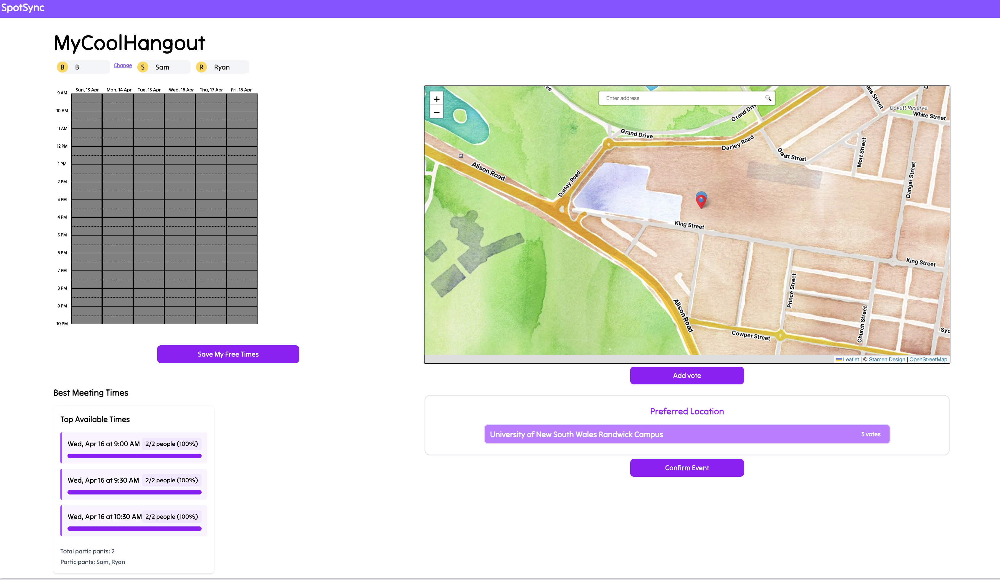
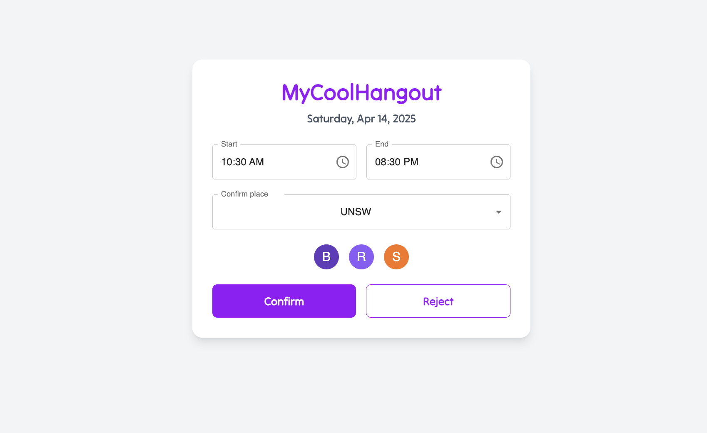
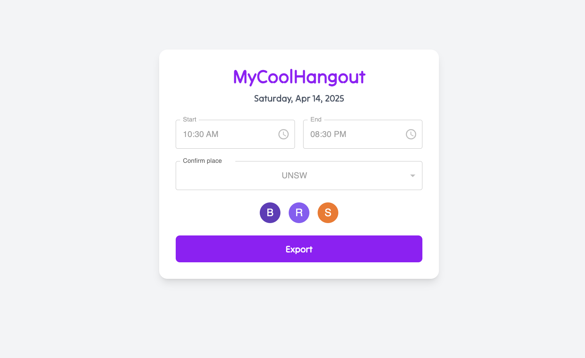

# SpotSync
##### From plans to places in seconds 

## Inspiration
When making plans, in addition to finding a time that everyone is free, BUT the hassle of finding a place to meet that everyone agrees on is tedious. We want to resolve that problem for everyone.

## What it does
1. Allows groups of users to find the dates and times that they are all available, and also decide on a place to meet and have their event. Each user sets their available time and we find the best overlapping window. 2. Users also suggest places to meet, and seeing other suggestions on a map, vote on where they would prefer the most.
3. When time and place are confirmed, the calendar event link can be extract and added to google calendar or apple calendar
3. In the future, it can suggest bets meeting place with LLM help, that can generate the best meeting time and place for everyone to export

## How we built it
React and Tailwind CSS for frontend, Node.js for backend, Leaflet for maps, Firebase for storage, Figma and Figjam for UI, UX and product.

## Challenges we ran into
- Optimising our UX to be the easiest and most intuitive flow for users. 
- Making all features functional and aesthetic by the deadline.
- Integrating with map libraries and customization features.
- As a group of 6, working with git and merging conflict is INSANE.

## Accomplishments that we're proud of
1. Cracked the execution of the  availability component, so basically we recreate a when2meet
2. Adding a pretty and working map for address search
3. A database and backend that allows multi-user sync and input
4. A beautiful chart that shows the top 3 best meeting time and a poll table that allows voting and automatically generate the winner in real time!


## What we learned
1. We have better understanding for backend and how to design a data structure.
2. We learned how to integrate firebase
3. How to do pair programming and how to allocate work with minimal merge conflicts

That attention to detail is key, prioritising work is essential, and that we're a very capable team who we can build anything should we plan well and and follow a procedure in implementing features.

## What's next for SpotSync
1. A better looking availability component, with more interactive response.
2. Animation and function demonstration in home page for better UI/UX experience
3. A more elegant and clear layout for our main page, so user can use it more intuitively without being overwhelmed
4. A LLM model to help suggesting meeting place
5. Integration with google map to check the opening hours as well as score for locations
6. Allow import from third party calendar to make input easier
7. User information security
8. Allow to create recurring event, catering more needs.
9. Clickable map so user can select location directly from map

All in all, we do think this is a very useful app and will make a lot of people's life easier. So far, there's no app or web that allows users to decide time and place all together, so we think the idea is very promising.

### Demo Screenshots









#### Requirements
- Node.js v22 (download from https://nodejs.org/en)
- Firebase project with a firestore database


#### How to get started locally: 

1. Clone this repo: `git clone https://github.com/SammriddhGupta/SpotSync.git` or use SSH clone method as per your preference

<br>

2. **Setup Backend** 
By navigating to the backend directory:
```bash
cd backend
```
3. Install backend dependencies:
```bash
npm install
```

4. **Create a `.env` file**
Create a file named `.env` in the `backend directory` and add your Firebase configuration:
```env
FIREBASE_API_KEY=your_api_key
FIREBASE_AUTH_DOMAIN=your_project_id.firebaseapp.com
FIREBASE_PROJECT_ID=your_project_id
FIREBASE_STORAGE_BUCKET=your_project_id.appspot.com
FIREBASE_MESSAGING_SENDER_ID=your_messaging_sender_id
FIREBASE_APP_ID=your_app_id
FIREBASE_MEASUREMENT_ID=your_measurement_id

```

5. Start the backend server
```bash
node server.js
```
By default, the server will run on **port 5001**.


6. **Setup Frontend**
Open a new terminal and stay at the root folder

7. Install frontend dependencies:
```bash
npm install
```

7. Run `npm install` 

8.  start the frontend server by running
```bash
npm run dev
```